# 傲来史（Markdown版）

本史书为人工与AI合做

编者：礼部尚书

类型：编年体断代史

## 前言

本史书由傲来皇（傲来国国主）指派礼部尚书所做，编辑仓促且信息不完整，暂且宽恕！若有问题可随时指出。

本史书除前三面外，标题均以28字号（Word）撰写，小标题与正文均以20字号（Word）撰写。

除第一面外，整本史书均以“仿宋”为字体。

## 序言

题记：天下大事分久必合，合久必分……
话说，这乙巳蛇年下旬起，天下现出一群能者，因无由而来，便相缘而聚。中有一学者，名曰李越航。其人胜于现状，却未安于现状，勃勃的野心让其再无可所奈。从此，傲来，便拉下了帷幕……

## 目录

（2025-2026启）

第1部分       									    七年级上学期

第2部分  											七年级下学期

第3部分  											八年级上学期

第4部分  											八年级下学期

第5部分  											九年级上学期

第6部分  											九年级下学期

## 第一部分  七年级上学期

注：由于此学期未特意进行时间记述，所以本部分的所有事件略写。

1. 李越航于2025年11月1日建立大明王朝，后将国号改为傲来，自称傲来皇，订C++为国内正统编程语言，订年号为“齐天”。

2. 兵部尚书第一次谋反（具体时间已不可考），企图联结亲王李子谦夺权篡位，最终被平定。

3. 水母帝国与傲来国同时建立，初期势力庞大，但随后因多位臣将相继离开，而逐渐没落。

## 第二部分  七年级下学期

齐天（福穆）二年（公元2026年）
1. 春，三月上旬，兵部尚书因与傲来皇相处时，常常认为其行为过于激进，导致身体、心理均收到伤害，愤发不满， 便与常紫焰联结，企图第二次谋反，并贬低傲来皇，怂恿刑、礼部尚书退出傲来国（最终二人并未退出）。最终经傲来皇疏导，兵部尚书放弃谋反。

2. 春，三月中旬，兵部尚书因认为傲来皇的行为未有改进，便对其十分失望。通过并不周全的分析后，他认为自己已无法正常的生活下去，大怒，便再次怂恿周边臣相退出傲来国，同时准备第三次谋反。傲来皇听后，再无隐忍，认为兵部尚书的野心过大，当即取消兵部尚书官职，并将其驱逐出境。距知情人士打探，王辰阳（即前兵部尚书）进入水母帝国。随后傲来皇进行一系列官职调动：将刑部尚书调为兵部尚书、将陶瑞奇订为刑部尚书、将王一一（前为水母帝国臣相，但随后叛变，退出水母帝国，原因不详）定为工部尚书。

3. 春，三月下旬，傲来皇同礼部尚书开始编制傲来语，具体内容详见《傲来语官方语法白皮书》。至三月末，虚作用域已编制完毕，可实作用域仍在构思之中。

4. 三月中的每个周日，花果山总会发生轻微的皇室内斗，其内容总是围绕一位神秘人物——LYL。傲来皇从未向任何人员透露过LYL的任何信息，但有大量确切证据表明，LYL是一位真实人物，且与傲来皇关系密切。此外，傲来皇培养出一个新爱好：让纸张在笔尖旋转起来。

5. 春，四月上旬，傲来皇订其谥号为傲来玉穹无为上显经通灵神庄文武开国至尊齐天移山合道皇帝。

6. 春，四月上旬，礼部尚书制定傲来语的动词构词法（详见《傲来语官方语法白皮书》）。然而，由于作用域的目的是修饰，无法无理由定义词语（与英语相反），导致名词构词法的制定异常艰难。现有一种类似递归（分治）的假想，试图将一个名词所指的事物不断分接，使得最终分解的一个个小事物能用极少的作用域表示出来，在将这些小事物合并成原本的事物。但按这种假想构成的名词结构极其冗余，不易阅读与理解。

7. 春，四月上旬，傲来皇开设八卦局，设原刑部尚书舒瑞宁为八卦局局长。八卦局的目的是为傲来国搜取情报，同时及时回报国内重要信息。

8. 春，四月中旬，傲来皇下令让各部尚书编写相应的法律，最终汇集成《傲来法》。《傲来法》主要包括：宪法、刑法、国防法、吏法、劳动法、礼法等（详见《傲来法》）。

9. 春，四月中旬，傲来皇开设国库，命户部尚书为国库管理员。国库中主要储存各类奶制品，分别为：纯牛奶、酸牛奶、AD钙奶与旺仔牛奶。1瓶酸牛奶兑3瓶纯牛奶，1瓶AD钙奶兑3瓶纯牛奶，1瓶旺仔牛奶兑4瓶纯牛奶。借取a瓶奶制品，一周内须按原数量返还，每延迟n周，须返还的数量为2na瓶（不满一周按一周算）。

10. 春，四月下旬，为削减水母帝国国力，同时加强傲来国对水母帝国的管理，傲来皇命高昱博为KGB（卧底），假装加入水母帝国，实则是为傲来国获取水母帝国的情报。为加强其隐蔽性，傲来令徐继峰等三人同与昱博一同加入水母帝国，并让其故意露出破绽，为高昱博打下掩护，使水母帝国发现其KGB的身份并将其赶出后自认为国内已没有KGB，从而更好的隐藏高昱博。

11. 四月中，王辰阳依靠其地理优势，常怂恿礼部尚书加入水母帝国。他曾多次贬低傲来皇，并谎造一些傲来国中并不存在的问题。

12. 四月中，编者发现傲来皇分不清“ne”与“le”。例如傲来皇在说“然后呢”时，总是发音成“然后le”。

13. 夏，五月上旬，傲来皇命户部尚书为KGB（卧底），依靠其在一次国家集会中表现失利为背景，假装将户部尚书驱逐出傲来国并令其加入水母帝国，使其成为第二位针对水母帝国的KGB。一周后，傲来皇公布户部尚书的身份，并取消其KGB职位。

14. 夏，五月上旬，傲来皇在与工部尚书的交谈中，初步表达了他对“五天计划”的设想。“五天计划”意在以5天为一个周期（阶段），有秩序的完成一项项国家治理政策，从而促进国家发展，保持社会安定。

15. 夏，五月中旬，傲来皇开始利用OpenClaw研发一项大型C++项目：物理模拟器。该模拟器可以模拟基本物理定律与许多复杂物理定律，但仅支持显示2D画面。目前基本代码已完成，但还需要解决2个Bug：无法添加物品、无法模拟重力。

16. 夏，五月中旬，傲来皇开始利用汇编语言（x86）研发一款高级语言 —— ALL（Aolai Languege），研发周期约为5-12个月。ALL的设计理念是这样的：运行速度 > 程序严谨性 > 程序可读性 > 编译速度。ALL以C++为基石，在此之上引入了object（对象），相当于class（类）的拓展，此外还有一些特性，详见附录五。

17. 随着时间的推移，傲来国的君主经过“历历代代的更迭”，终于迎来了“最后一位”皇帝（但据本史书记载，傲来国有且仅有一代皇帝）。他昏庸无道，压榨百姓与臣相；实行暴政，使得国内战乱无数，民不聊生。最紧急的是，由于其多年命令军队征战四方，使得国库空虚，经济收到的极为沉重的打击。最终，傲来天国与齐天（福穆）二年（公元2026年）5月15日在进行了最后一次全国会议后正式宣布解体，傲来苏维埃社会主义共和国联盟成为其唯一合法继承国，由李越航担任最高统帅部。李越航上位后，对国家进行了以下整治：（1）政治方面：李越航废除了古老的中国（明代）官制，而是使用苏联官制。目前（5.23）唯一的问题是官位数量（约150）与官员数（23）相差过大。绝大部分官员与职位均能匹配，只有“陈远志为卫生部部长”这一匹配受有争议，原因不再赘述；（2）经济方面：李越航令王懿一、陶瑞奇制作纸质实物货币（傲来通宝），代替的此前的虚拟货币，面额分别为1、5、10、20、50，有利于国家对货币进行管理。货币的防伪标志是使用AES-256-GCM对货币的编号进行加密后的字符乱码。但由于乱码过长，目前（5.23）还未能得出将乱码完整、美观书写（印刷）在货币上的方法；（3）工业方面：李越航决定大力发展重工业；（4）军事方面：李越航开始组建红军（苏盟武装力量），目前（5.23），第一集军团已有9人，第二集军团已有3人，且第一集军团配有生化武器；其余整治详见5月21日傲来国最高苏维埃发布的“傲共中央（布）最高指示文件”。

18. 2026年5月24日，由于不明原因，水母帝国灭亡。

## 附录

## 附录一：傲来国1版官职表（李越航 制）

## 附录二：傲来国2版官职表（王懿一 制）

## 附录三：傲来国3版官职表（王懿一 制）

```mermaid
graph TB
    a[领袖：李越航——最高统帅部]---b[地方机构] & c[中央国家政治机构] & d[联盟共产党] & e[非常设机构]
    b---b1[加盟共和国级]
    b1---b11[502苏维埃社会主义共和国] & b12[503苏维埃社会主义共和国] & b13[214联邦苏维埃] & b14[213苏维埃社会主义共和国]
    b11---b1z[委员]
    b12---b1z
    b13---b1z
    b14---b1z
    b1z---b1z1[第一书记]
    b1z1---b1z11[502：黄仁智] & b1z12[503：暂无] & b1z13[214：李子骞] & b1z14[213：王懿一]
    b1z---b1z2[主席]
    b1z2---b1z21[502:徐继峰] & b1z22[503：暂无] & b1z23[214:陈铭俊] & b1z24[213:吴思远]
    b1---b21[加盟共和国共产党委员会] & b22[加盟共和国最高苏维埃] & b23[加盟共和国人员委员会]
    b21---b211[第一书记]
    b22---b221[主席]
    b23---b231[主席]
    b211---b2z[州/边疆区/市/区]
    b231---b2z
    b2z---b31[地方党委]
    b2z---b32[地方苏维埃]
    b2z---b33[地方执行委员会]
    b2z---b34[地方内名局]
    b31---b311[第一书记]
    b32---b321[主席]
    b34---b341[KGB分局局长]
    b311---b3z[人民群众]
    b341---b3z
    c---c1[总参谋部] & c2[苏盟最高苏维埃] & c3[人民委员会] & c4[国安与司法部] & c5[计划经济委员会] & c6[专利局] & c7[异常研究机构：陶瑞奇]
    c1---c11[总参谋长：李彦璐]
    c2---c21[联盟院] & c22[民族院] & c23[最高苏维埃主席院]
    c21---c2z[院主席：李穆祈]
    c22---c2z
    c23---c231[主席：李越航]
    c3---c31[各核心人民委员会部] & c32[主席：李彦璐]
    c31---c3101[外交人民委员部] & c3102[国防人民委员部] & c3103[内务人民委员部] & c3104[重工业人民委员部] & c3105[轻工业人民委员部] & c3106[财政人民委员部] & c3107[贸易人民委员部] & c3108[陆军部] & c3109[海军部] & c3110[空军部] & c3111[国家安全部] & c3112[宣传文艺部] & c3113[教育部] & c3114[卫生部] & c3115[原子能部] & c3116[宣传部] & c3117[乒乓球部]
    c3101--- c31011[马三川] & c31012[副：暂无]
    c3102--- c31021[舒瑞宁] & c31022[副：暂无]
    c3103--- c31031[陶瑞奇] & c31032[副：暂无]
    c3104--- c31041[王懿一] & c31042[副：暂无]
    c3105--- c31051[王懿一] & c31052[副：暂无]
    c3106--- c31061[邱益瑞] & c31062[副：暂无]
    c3107--- c31071[李子骞] & c31072[副：暂无]
    c3108--- c31081[李瑞齐] & c31082[副：暂无]
    c3109--- c31091[宋皓轩] & c31092[副：暂无]
    c3110--- c31101[黄钰涵] & c31102[副：暂无]
    c3111--- c31111[陶瑞奇] & c31112[副：暂无]
    c3112--- c31121[黄仁智] & c31122[副：暂无]
    c3113--- c31131[陶瑞奇] & c31132[副：暂无]
    c3114--- c31141[陈远志] & c31142[副：暂无]
    c3115--- c31151[暂无] & c31152[副：暂无]
    c3116--- c31161[暂无] & c31162[副：暂无]
    c3117--- c31171[陈亭俞] & c31172[副：暂无]
    c32---c321[副主席：李子骞]
    c4---c41[国家安全总局（KGB）] & c42[最高法院] & c43[最高检察院] & c44[内务人民委员会（NKVB）] & c45[红军/苏盟武装力量]
    c41---c411[主席：李子骞]
    c411---c4111[花果山总局] & c4112[地方分局]
    c4111---c411100[局长：暂无] & c411101[第一总局] & c411102[第二总局] & c411103[第三总局] & c411104[第四总局] & c411105[第五总局] & c411106[第六总局] & c411107[第七总局] & c411108[第八总局] & c411109[第九总局] & c411110[第十总局] & c411111[第十一总局] & c411112[第十二总局] & c411113[第十三总局] & c411114[第十四总局] & c411115[第十五总局] & c411116[对水母局（17）] & c411117[对水仙局（18）]
    c411101---cx1[局长：暂无]
    c411102---cx2[局长：暂无]
    c411103---cx3[局长：暂无]
    c411104---cx4[局长：暂无]
    c411105---cx5[局长：暂无]
    c411106---cx6[局长：暂无]
    c411107---cx7[局长：暂无]
    c411108---cx8[局长：暂无]
    c411109---cx9[局长：暂无]
    c411110---cx10[局长：暂无]
    c411111---cx11[局长：暂无]
    c411112---cx12[局长：暂无]
    c411113---cx13[局长：暂无]
    c411114---cx14[局长：暂无]
    c411115---cx15[局长：暂无]
    c411116---cx16[局长：暂无]
    c411117---cx17[局长：暂无]
    c4112---c41121[502：高昱博] & c41122[503：马三川] & c41123[214：陈铭俊] & c41124[213：王懿一]
    c42---c421[大法官：暂无] & c422[审判长：许哲楷] & c423[总检察长：徐继峰]
    c421---c42z[加盟共和国法院]
    c422---c42z
    c423---c42z
    c42z---c42z1[地方法院]
    c43---c431[地方检察院]
    c44---c441[代委员：陶瑞奇] & c442[地方内名局]
    c442---c4421[502：暂无] & c4422[503：暂无] & c4423[214：暂无] & c4424[213：暂无]
    c45---c451[空天军] & c452[陆上武装力量] & c453[战队火特军] & c454[海上武装力量/红海军] & c455[超自然作战部队]
    c451---c4511[司令部：暂无]
    c452---c4521[装甲军司令：暂无] & c4522[炮兵司令：暂无] & c4523[步兵司令：暂无]
    c453---c4531[防空总司令：暂无] & c4532[反导总司令：暂无] & c4533[火箭总司令：暂无]
    c454---c4541[海军舰空司令部司令：暂无] & c4542[排雷司令：暂无] & c4543[反潜司令：暂无]
    c455---c4551[陶瑞奇]
    c4511---c45z[最高统帅：李越航]
    c4551---c45z
    c45z---c45z1[民兵司令部]
    c45z1---c45z11[司令：暂无] & c45z12[动员委员会] & c45z13[测练委员会]
    c45z12---c45z121[主席：暂无]
    c45z13---c45z131[主席：暂无]
    c5---c51[主席] & c52[全国总纪委会长：暂无] & c53[农业集体化司长：暂无] & c54[农业司长：暂无] & c55[工业司长：暂无] & c56[商品经济司长：暂无] & c57[五日计划执行处] & c58[人口计划司长：陶瑞奇]
    c53---c531[集体农庄]
    c531---c5311[502负责人：暂无] & c5312[503负责人：暂无] & c5313[214负责人：暂无] & c5314[213负责人：暂无]
    c7---c71[“进步”研究中心] & c72[KGB算十六局] & c73[NKVD第333处] & c74[214医学部队] & c75[GRU超心理学部门]
    d---d1[全国代表大会] & d2[中央委员会] & d3[中央军事委员会] & d4[中央监督委员会] & d5[联共（布）]
    d1---d11[会长：任令仪]
    d2---d21[政治局] & d22[组织局] & d23[书记处]
    d21---d211[书记：李芷慕]
    d22---d221[书记：暂无]
    d23---d231[总书记：李越航]
    d3---d31[主席：李越航]
    d11---dz1[共青团] & dz2[少先队]
    d5---dz1 & dz2
    dz1---dz2
    dz1---dz11[共青团主席：俞欣怡]
    dz11---dz111[地方支部书记]
    dz111---dz1111[502：暂无] & dz1112[503：暂无] & dz1113[214：暂无] & dz1114[213：暂无]
    dz1111---dz1z[团员]
    dz1112---dz1z
    dz1113---dz1z
    dz1114---dz1z
    dz2---dz21[全国总书记：高昱博]
    dz21---dz211[地方支队长]
    dz211---dz2111[502：暂无] & dz2112[503：暂无] & dz2113[214：暂无] & dz2114[213：暂无]
    dz2111---dz2z[队员]
    dz2112---dz2z
    dz2113---dz2z
    dz2114---dz2z
    e---e1[斯沃什（锄奸部）] & e2[国家政治保安部]
    e1---e11[锄奸人员委员]
    e11---e111[502：暂无] & e112[503：暂无] & e113[214：暂无] & e114[213：暂无]
    e2---e21[人民委员：暂无]
    e21---e211[地方司长]
    e211---e2111[502：暂无] & e2112[503：暂无] & c2113[214：暂无] & e2114[213：暂无]
```

## 附录四：傲来国1版版图（王懿一 制）

## 附录五：一部分与编程相关的网站的网址

C++官网：*https://en.cppreference.com*

Rust官方教程（中文）：*https://rustwiki.org/zh-CN/book/*

Rust官方教程（英文）：*https://doc.rust-lang.org/book/*

Python官网：*https://docs.python.org/zh-cn/3/*

Visual Studio Code（一个便利的代码编辑器）下载网址：*https://code.visualstudio.com/download*

OJ网址：*http://oj.stepupon.com*

洛谷网址：*https://www.luogu.com.cn/*

## 备注

-  Cmd+Shift+V打开预览窗口。